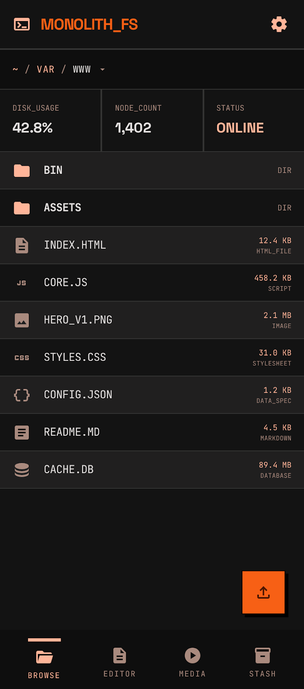
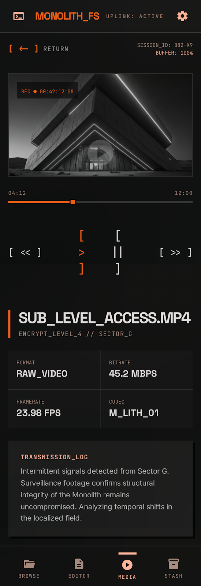

## Tech stack

| Technology | Version | Purpose |
|-----------|---------|---------|
| React | 19 | UI framework |
| TypeScript | 6 | Type safety |
| React Router | 7 | Client-side routing |
| Tailwind CSS | 4 | Utility-first styling |
| Vite | 8 | Build tool + dev server |
| tus-js-client | 4 | Resumable uploads |
| iconoir-react | 7 | Icon library |

## Routing

```
/login          → LoginPage (also handles first-run setup)
/browse/*       → BrowserPage (directory listing + search)
/edit/*         → EditorPage (text file editor)
/play/*         → PlayerPage (video/audio player)
/preview/*      → PreviewPage (image/document preview)
```

All routes except `/login` are protected by an auth guard in `App.tsx`. Pages are loaded via `React.lazy` for code splitting.

## State management

No external state library. State is managed through:

- **`useAuth`** — Auth context provider wrapping the app. Manages token, user, login/logout/refresh. Stores token in memory (not localStorage). A `rustyfile:auth-expired` custom window event triggers automatic logout.
- **`useFiles`** — Directory listing, delete, and create-directory operations. Wraps the API client.
- **`useTusUpload`** — Upload queue with concurrency control (max 3). Manages TUS lifecycle, progress tracking, and cancellation.
- **`useSearch`** — Search with debounced input. Wraps the `/api/fs/search` endpoint with type/size/date filters.
- **`useDragDrop`** — Drag-and-drop event handling. Falls back to file picker.

## API client

`api/client.ts` provides a fetch wrapper that:

- Automatically attaches the Bearer token from auth context
- Parses JSON responses
- On `401` from any non-auth endpoint, dispatches `rustyfile:auth-expired` to trigger logout
- Throws `ApiClientError` with `status` and `code` fields for error handling

## Component structure

```
Layout
├── Sidebar (desktop navigation, quicklinks, storage meter placeholder)
├── BottomNav (mobile tab bar)
└── Page content
    ├── Breadcrumbs (clickable path segments)
    ├── FileList → FileRow (sortable directory listing)
    ├── UploadManager (progress panel)
    ├── UploadFAB (mobile floating action button)
    ├── DropZone (drag-over overlay)
    └── VideoControls (scrubber, play/pause, volume, fullscreen)
```

## Build

```bash
cd frontend
pnpm install
pnpm build    # tsc -b && vite build → frontend/dist/
pnpm dev      # dev server on :5173, proxies /api/* to :8080
```

The production build outputs hashed assets to `frontend/dist/`. When the Rust binary is built with `--features embed-frontend` (default), these files are embedded via `rust-embed` and served with immutable cache headers.

## Design system

The UI follows "The Industrial Monolith" — a brutalist design language built for speed and clarity.

### Color tokens

| Token | Value | Usage |
|-------|-------|-------|
| `--color-background` | `#090909` | Page background |
| `--color-surface` | `#141414` | Card/panel backgrounds |
| `--color-surface-high` | `#201F1F` | Elevated surfaces |
| `--color-surface-bright` | `#353534` | Highlighted surfaces |
| `--color-borders` | `#2C2C2C` | Borders and dividers |
| `--color-primary` | `#E45301` | Primary orange accent |
| `--color-primary-light` | `#FFB599` | Light orange variant |
| `--color-primary-container` | `#F76015` | Action buttons |
| `--color-text-main` | `#F2F2F2` | Body text |
| `--color-muted` | `#7A7A7A` | Secondary text |
| `--color-outline` | `#A98A7E` | Tertiary/outline color |

### Typography

| Font | Usage |
|------|-------|
| **Space Grotesk** (400–700) | Headlines, display, navigation |
| **JetBrains Mono** (400–700) | Metadata, labels, code, data |

### Design rules

- **0px border radius** everywhere — sharp corners, no exceptions
- **Hard shadows** (`4px 4px 0px 0px #000`) — physical offset, never blurred
- **2% noise texture** overlay via SVG filter for analog depth
- **Surface hierarchy** — stacked plates: background → surface → surface-high → bright
- **No divider lines** — use background color shifts between sections

### Responsive layout

Desktop uses a sidebar with navigation and quicklinks. Mobile switches to a bottom tab bar (Browse, Editor, Media, Stash).



