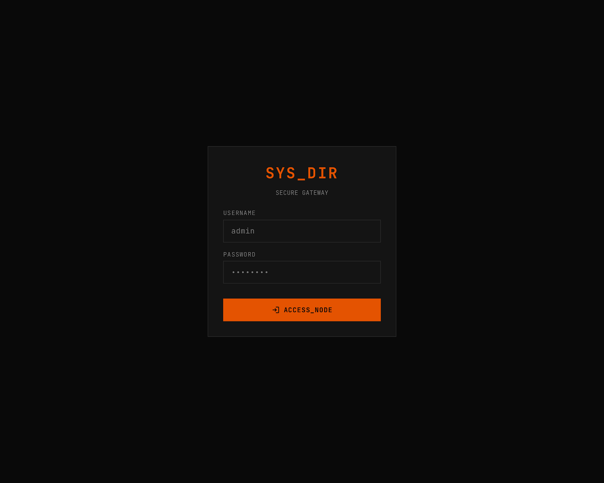

## Overview

RustyFile uses **JWT (HS256)** tokens with **Argon2id** password hashing. Tokens are delivered both as a JSON response body and as an `HttpOnly` cookie named `rustyfile_token`.

## Auth flow

```
POST /api/setup/admin     →  Create admin (first run only)
POST /api/auth/login      →  Get JWT token
GET  /api/fs/...          →  Use token (Bearer header or cookie)
POST /api/auth/refresh    →  Renew token before expiry
POST /api/auth/logout     →  Clear cookie
```

## Login

```bash
curl -X POST http://localhost:8080/api/auth/login \
  -H "Content-Type: application/json" \
  -d '{"username": "admin", "password": "your-password"}'
```

Response:
```json
{
  "token": "eyJhbGci...",
  "user": { "id": 1, "username": "admin", "role": "admin" }
}
```

## Using the token

Two methods, both accepted on all protected endpoints:

```bash
# Bearer header
curl -H "Authorization: Bearer eyJhbGci..." http://localhost:8080/api/fs/

# Cookie (set automatically by login)
curl -b "rustyfile_token=eyJhbGci..." http://localhost:8080/api/fs/
```

The web UI uses the cookie automatically. The Bearer header is useful for API integrations.

## Token refresh

Tokens expire after 2 hours by default (configurable via `jwt_expiry_hours`). Refresh before expiry:

```bash
curl -X POST http://localhost:8080/api/auth/refresh \
  -H "Authorization: Bearer eyJhbGci..."
```

The refresh endpoint re-validates the user exists in the database before issuing a new token.

## Security measures

| Measure | Description |
|---------|-------------|
| **Argon2id hashing** | Industry-standard password hashing, resistant to GPU/ASIC attacks |
| **Rate limiting** | 10 login attempts per 15 minutes per IP (leaky bucket via `governor`) |
| **Constant-time failure** | Failed logins verify against a dummy hash to prevent username enumeration via timing |
| **HttpOnly cookies** | Tokens are not accessible to JavaScript, preventing XSS token theft |
| **JWT secret** | Generated randomly at first run, stored in SQLite — unique per installation |

## Logout

```bash
curl -X POST http://localhost:8080/api/auth/logout
```

Clears the `rustyfile_token` cookie. No authentication required.
