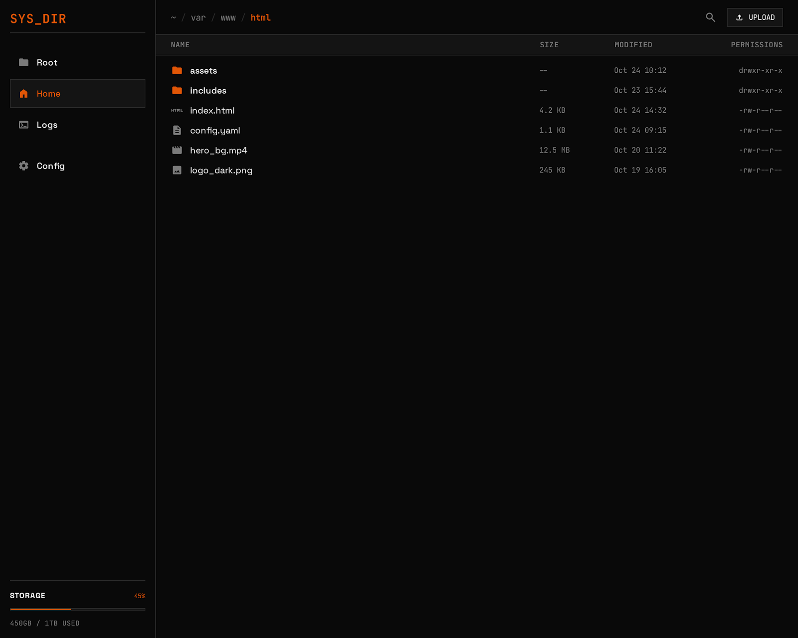
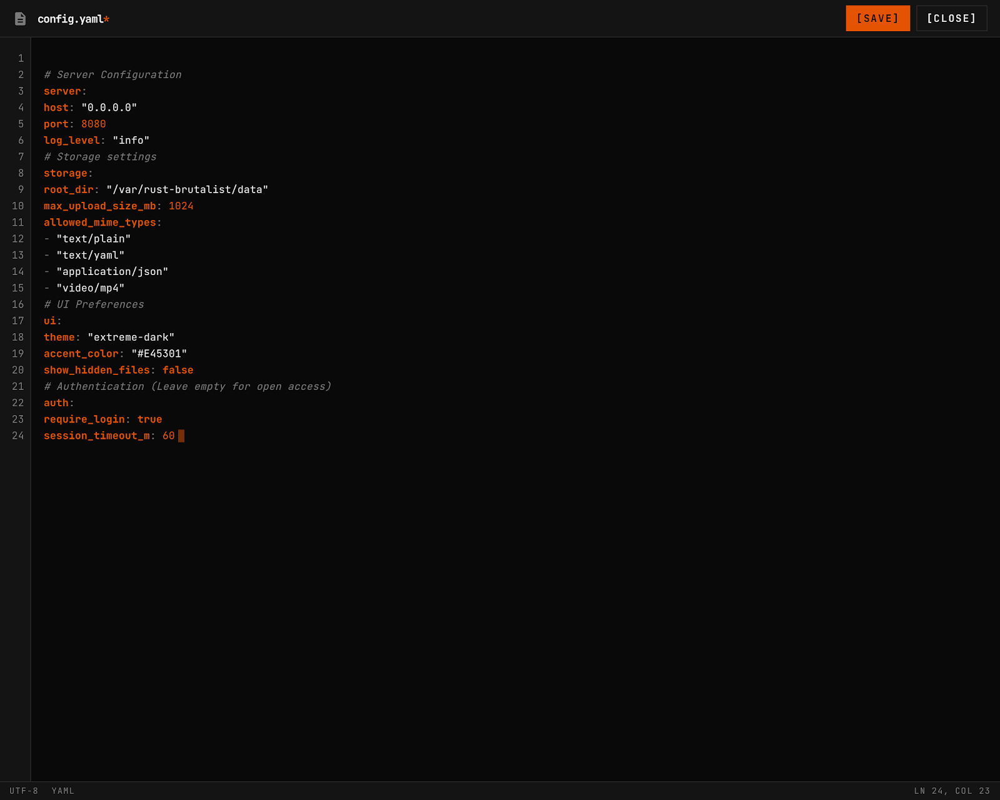

## Directory listing

The file browser displays directory contents with sortable columns:

- **Name** — file or directory name
- **Size** — human-readable file size
- **Modified** — last modification date
- **Type** — MIME type (derived from extension)

Sort by clicking column headers. Ascending and descending supported.

## File operations

### Download

Click any file to download it. The download endpoint supports HTTP range requests, so download managers and `curl --continue-at` work correctly.

### Create directory

Use the **New Folder** button to create a directory in the current location.

### Delete

Select files or directories and delete them. Directory deletion is recursive. The root directory is protected and cannot be deleted.

### Rename / Move

Rename a file or move it to a different path. Optionally overwrite the destination.

```bash
# API example
curl -X PATCH http://localhost:8080/api/fs/old-name.txt \
  -H "Authorization: Bearer TOKEN" \
  -H "Content-Type: application/json" \
  -d '{"destination": "new-name.txt", "overwrite": false}'
```

## Text editor



Files detected as text (based on MIME type) open in the built-in editor:

- **Line numbers** with gutter
- **Save** with `Ctrl+S` / `Cmd+S`
- **Modified indicator** shows unsaved changes
- **Navigation guard** warns before leaving with unsaved changes
- **Cursor position** displayed as line:column

Text content is returned inline for files up to **5 MB**. Larger text files can be downloaded.

Saves are **atomic** — a temp file is written and renamed, preventing partial writes on crash.

## Search

The file browser includes a search bar for finding files by name across the entire filesystem.

- **Full-text search** powered by SQLite FTS5
- **Type filtering** — narrow results by: `file`, `dir`, `image`, `video`, `audio`, `document`
- **Size and date filters** — filter by `min_size`, `max_size`, `after`, `before`
- **Path scoping** — limit search to a subdirectory
- **Debounced input** — queries fire after a short delay to avoid excessive requests

```bash
# API example — search for "readme" files
curl "http://localhost:8080/api/fs/search?q=readme&type=file&limit=20" \
  -H "Authorization: Bearer TOKEN"
```

The search index is built in the background on startup and updated incrementally as files change via the filesystem watcher.

## Breadcrumbs

The path bar shows clickable breadcrumb segments. Click any segment to navigate up the directory tree.

## Inline content preview

When browsing directories, the API can return text file content inline:

```bash
curl "http://localhost:8080/api/fs/path/to/dir?content=true&sort=name&order=asc" \
  -H "Authorization: Bearer TOKEN"
```

## Directory listing cache

Directory listings are cached in memory (moka cache) with:

- **30-second TTL** — entries expire after 30 seconds
- **15-second TTI** — entries expire 15 seconds after last access
- **1,000 entry cap** — LRU eviction beyond this limit
- **Filesystem watcher** — changes detected by `notify` invalidate the cache within 500ms

This means repeated requests for the same directory are served from memory, but filesystem changes are reflected quickly.
