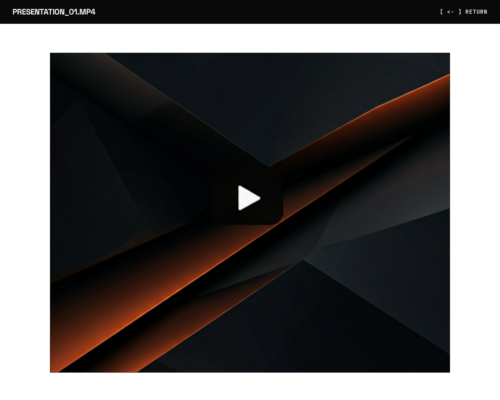

## Direct playback

Click a video file to open the built-in player. The player uses a native HTML5 `<video>` element with custom controls:

- **Scrubber** — seek to any position
- **Play / Pause**
- **Volume toggle**
- **Fullscreen**

Video is served via the download endpoint with **HTTP range request** support, enabling seeking without downloading the entire file.

### Supported formats (direct play)

Any format supported by the browser's native `<video>` element:

| Format | Container | Codec |
|--------|-----------|-------|
| MP4 | .mp4 | H.264, H.265 (browser-dependent) |
| WebM | .webm | VP8, VP9 |
| Ogg | .ogg | Theora |

## HLS transcoding

For formats not natively supported by the browser, RustyFile offers **on-demand HLS transcoding** via FFmpeg.

### How it works

1. Request the playlist: `GET /api/hls/playlist/{path}`
2. RustyFile probes the video duration with `ffprobe`
3. Generates an m3u8 playlist with 10-second segments
4. Each segment is transcoded on-demand when requested
5. Segments are cached to disk (keyed by file path + modification time)

### Transcoding settings

| Setting | Value |
|---------|-------|
| Segment duration | 10 seconds |
| Video codec | libx264 |
| Video preset | veryfast |
| Video CRF | 23 |
| Audio codec | AAC |
| Audio bitrate | 128k |
| Output format | MPEG-TS |
| Max concurrent | 2 FFmpeg processes |

### Cache behavior

Segments are cached at `{data_dir}/cache/hls/{source_key}/{index}.ts`. The cache key is a blake3 hash of the file path + modification time, so re-transcoding only happens if the source file changes.

:::note
FFmpeg and ffprobe must be installed and on your `PATH` for HLS to work. Without them, the HLS endpoints return an error.
:::

## Subtitles

RustyFile **automatically detects** subtitle files adjacent to video files. It looks for files with the same stem and these extensions:

- `.vtt` (WebVTT)
- `.srt` (SubRip)
- `.ass` / `.ssa` (Advanced SubStation Alpha)

**Example:** If you have `movie.mp4`, RustyFile will find `movie.vtt`, `movie.en.srt`, etc.

## Caching headers

| Endpoint | Cache-Control |
|----------|---------------|
| File download | `private` (auth-gated) with ETag + Last-Modified |
| HLS segments | `public, max-age=86400, immutable` |
| Thumbnails | `public, max-age=86400, immutable` |

The download endpoint uses `private` because it requires authentication. HLS segments and thumbnails use aggressive public caching since their cache keys change when the source file changes.
